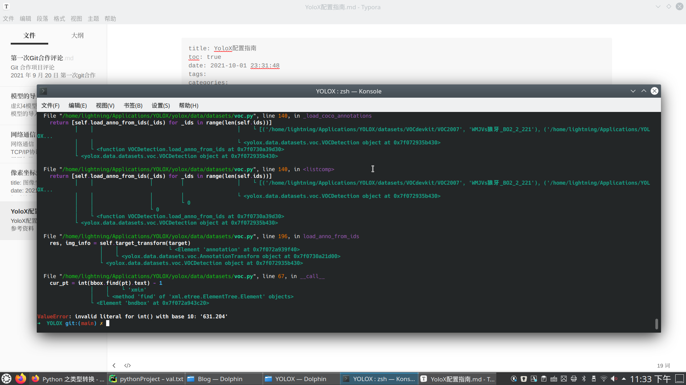

---

title: YoloX配置指南
toc: true
date: 2021-10-01 23:31:48
tags: 
	－　YoloX　
categories: 
	－　深度学习
	－　实验日志
---


## 实验目的

为测试YoloX 并进行自定义数据集训练

## 数据集

采用Robomaster比赛大疆Roco官方数据集


### 对象特性

YOLOv5:

- Hyperparams evolution.
- Different loss weights for different FPN layers
- CIoU (I'm not sure.)

YOLOX:

- Removal of box anchors (improves the portability of the model to edge devices), anchor free
- The decoupling of the YOLO detection head into separate feature  channels for box classification and box regression (improves training  convergence time and model accuracy)
- Leading label assignment strategy SimOTA
- Strong data augmentation: MixUp with large scale jittering, turn off strong augmentation in later iterations.

## 实验步骤

### 配置基础环境


### 命令行指令解读


### 测试Demo


### 添加自定义数据集


## 实验问题

### 问题1 ElementTree 解析XML失败

发现是XML文件损坏导致。

### 问题2 BBox 坐标获取失败



小数类型文本无法直接转化为整数类型，先进性eval取出转化为浮点数再转化为整数。


### 问题三 CUDA out of memory

```python
RuntimeError: CUDA out of memory. Tried to allocate 4.51 GiB (GPU  0; 6.00 GiB total capacity; 110.28 MiB already allocated; 4.44 GiB free; 120.00 MiB reserved in total by PyTorch)
```

此问题是由于显卡内存造成的由于训练需要一次性导入batch，如果batch_size 选择过大超出显存进而会导致改错误。为解决该问题可以考虑更换更大容量的显存的显卡或者修改batch_size的大小

### 问题四 assert num_gpu <= get_num_devices()

```python
Traceback (most recent call last):
  File "tools/train.py", line 122, in <module>
    assert num_gpu <= get_num_devices()
AssertionError
```

给定设备数量参数存在问题，根据自己显卡数量修改参与训练设备的数目

```shell
-d DEVICES, --devices DEVICES   #device for training
-d 1 # 仅存在一块显卡
```

### 问题四　训练时mAP一直为０

训练至epoch 10计算mAP＝0后失败，每进行10个epoch训练后，yolox会进行一次mAP的计算，但由于官方数据集在命名上存在空格，而官方在数据获取的时候采用strip函数，进而导致在计算mAP获取各文件数据的时候失败。
自行编写脚本进行批量重命名取代空格


## 参考资料
> - [Yolox 训练自己的数据集](https://blog.csdn.net/m0_56171249/article/details/119821714)
> - [difference between YOLOV5 and YOLOX #497](https://github.com/Megvii-BaseDetection/YOLOX/issues/497)
> - [YoloX 官方文档](https://github.com/Megvii-BaseDetection/YOLOX)